# Red Neuronal Conditional GAN

Red Generativa Adversaria con etiqueta del dígito como condición para generar mediante una GAN digitos escritos a mano (MNIST).

**Autor:** M. en C. Mario Xavier Canche Uc, Diciembre 2020, mario.canche@cimat.mx  

**Basado en: **
- https://www.cimat.mx/~mrivera/cursos/aprendizaje_profundo/dcgan/dcgan.html  
- https://www.tensorflow.org/tutorials/generative/dcgan

## ¿Qué son las GAN?
Las [redes generativas adversarias](https://arxiv.org/abs/1406.2661) (GANs) son una de las ideas más interesantes de la informática actual. Dos modelos son entrenados simultáneamente por un proceso contradictorio. Un *generador* ("the artist")  ("el artista") aprende a crear imágenes que parecen reales, mientras que un *discriminador* ("el crítico de arte") aprende a diferenciar las imágenes reales de las falsificaciones.


Durante el entrenamiento, el *generador* mejora progresivamente en la creación de imágenes que parecen reales, mientras que el *discriminador* mejora en distinguirlas. El proceso alcanza el equilibrio cuando el *discriminador* ya no puede distinguir imágenes reales de falsificaciones.
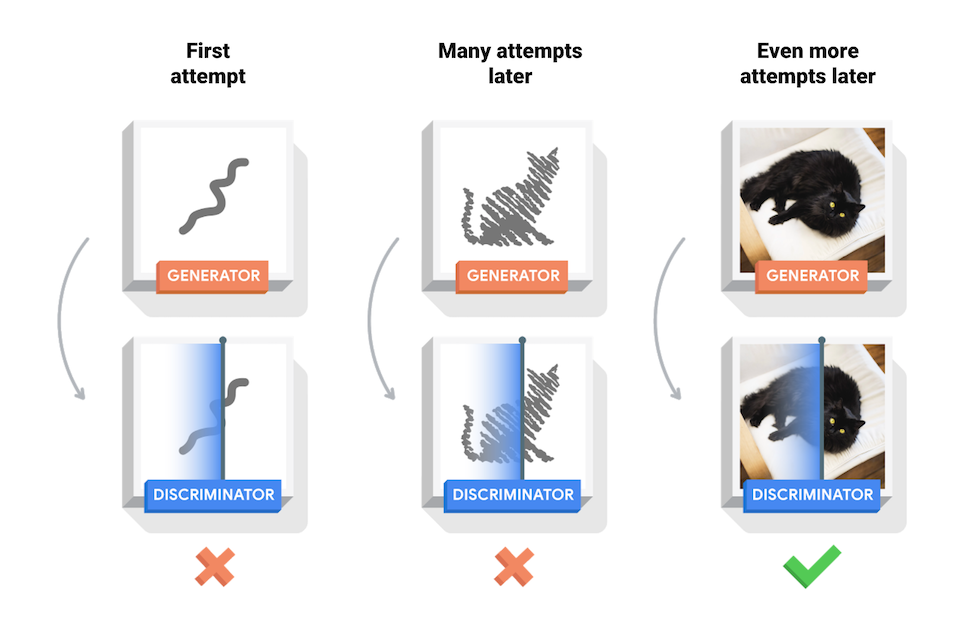

Para obtener más información sobre las GAN, recomendamos el curso [Intro to Deep Learning](http://introtodeeplearning.com/).

## Generador
```
from tensorflow.keras.utils import plot_model
from tensorflow.keras.layers import Flatten, Input, Embedding, multiply, Reshape

def build_generator(img_shape, z_dim, num_classes, verbose=False):
    '''
    Genera una imagen de 28x28x1 a partir de un vector aleatorio de 100 entradas (espacio latente)
    '''

    z = Input(shape=(z_dim,))
    # ---------------------------------------
    # Agregamos las etiquetas al generador
    label = Input(shape=(1,), dtype='int32')
    label_embedding = Flatten()(Embedding(num_classes, z_dim)(label))

    model_input = multiply([z, label_embedding])
    # ---------------------------------------

    # Pasa entrada unidimensional de dimensión 20 en un tensor de (7)(7)(256) tensor via un red Densa
    # luego la reformatea en un tensor de 7x7x128
    #X = Dense(256 * 7 * 7, input_dim=z_dim) (z)
    X = Dense(256 * 7 * 7, input_dim=z_dim) (model_input)

    X = Reshape((7, 7, 256))(X)

    # Convolución transpuesta, tensor de 7x7x256 a 14x14x128, con normalización por lote y activación ReLU
    X = Conv2DTranspose(filters    =128, 
                        kernel_size=3, 
                        strides    =2, 
                        padding    ='same')(X)

    X = BatchNormalization()(X)
    X = LeakyReLU(alpha=0.01)(X)
    
    # Convolución transpuesta, tensor de 14x14x128, a 14x14x64 con normalización por lote y activación ReLU
    X = Conv2DTranspose(filters    =64, 
                        kernel_size=3, 
                        strides    =1, 
                        padding    ='same')(X)
    X = BatchNormalization()(X)
    X = LeakyReLU(alpha=0.01)(X)
    
    # Convolución transpuesta, tensor de 14x14x128 a 28x28x1, con activación tahn
    Y = Conv2DTranspose(filters    =1, 
                        kernel_size=3, 
                        strides    =2, 
                        padding    ='same',
                        activation ='tanh')(X)
    
    #generator_model = Model(inputs = z, outputs = [Y], name ='generator')
    generator_model = Model(inputs = [z, label], outputs = [Y], name ='generator')
    
    return generator_model
```

## Discriminador
```
def build_discriminator(img_shape, num_classes, verbose=False):

    Xin = Input(shape=(img_shape[0],img_shape[1],img_shape[2],))

    # ---------------------------------------
    # Agregamos las etiquetas al discriminador
    label = Input(shape=(1,), dtype='int32')

    label_embedding = Flatten()(Embedding(num_classes, np.prod(img_shape))(label))
    label_reshape = Reshape((img_shape[0],img_shape[1],img_shape[2]))(label_embedding)

    model_input = multiply([Xin, label_reshape])
    # ---------------------------------------


    # Convolución2D tensor de 28x28x1 a 14x14x32 y activación Leaky ReLU
    X = Conv2D(filters     = 32, 
               kernel_size = 3, 
               strides     = 2, 
               input_shape = img_shape, 
               #padding     = 'same')(Xin)
               padding     = 'same')(model_input)
    #X = BatchNormalization()(X)
    X = LeakyReLU(alpha    = 0.01)(X)

    # Convolución2D tensor de 14x14x32 a 7x7x64, con normalización por lote y activación Leaky ReLU
    X = Conv2D(filters     = 64, 
               kernel_size = 3, 
               strides     = 2, 
               padding     = 'same')(X)
    X = BatchNormalization()(X)
    X = LeakyReLU(alpha    = 0.01)(X)
    
    # Convolución2D tensor de 7x7x64 a 3x3x128, con normalización por lote y activación Leaky ReLU
    X = Conv2D(filters     = 128, 
               kernel_size = 3, 
               strides     = 2,  
               padding     = 'same')(X)
    X = BatchNormalization()(X)
    X = LeakyReLU(alpha    = 0.01)(X)

    # Aplanado del tensor, y capa densa de salida de clasificacion con activación sigmoide
    X = Flatten()(X)
    Yout = Dense(1, activation='sigmoid')(X)

    #discriminator_model = Model(inputs = Xin, outputs = [Yout], name ='discriminator')
    discriminator_model = Model(inputs = [Xin,label], outputs = [Yout], name ='discriminator')

    return discriminator_model
```

## Resultados
- Primeras epocas:

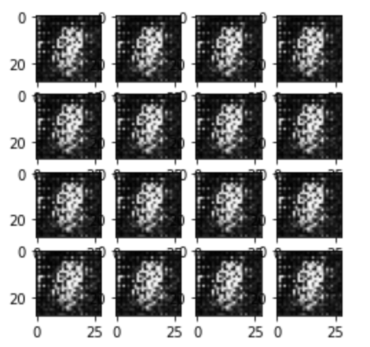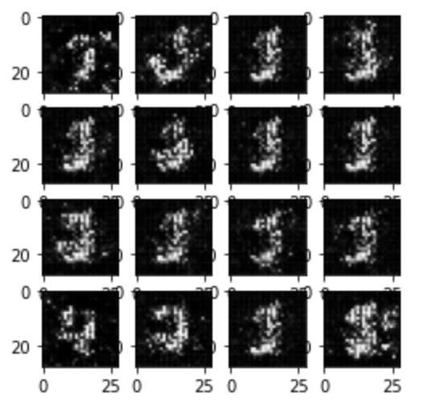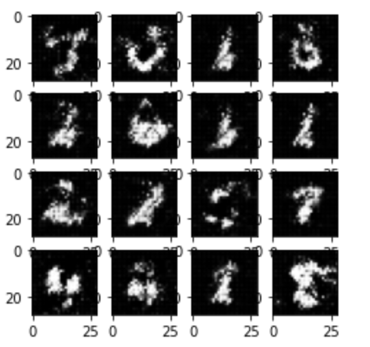
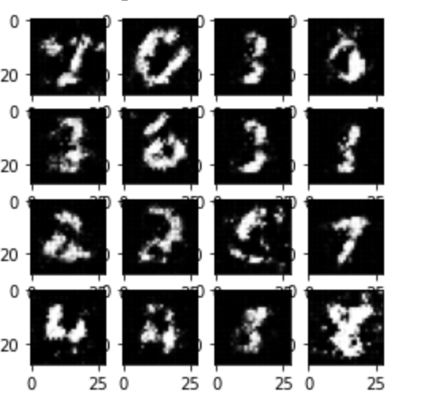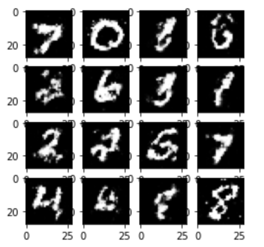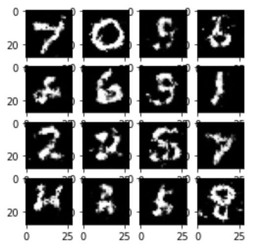

- Predicción/Generación:

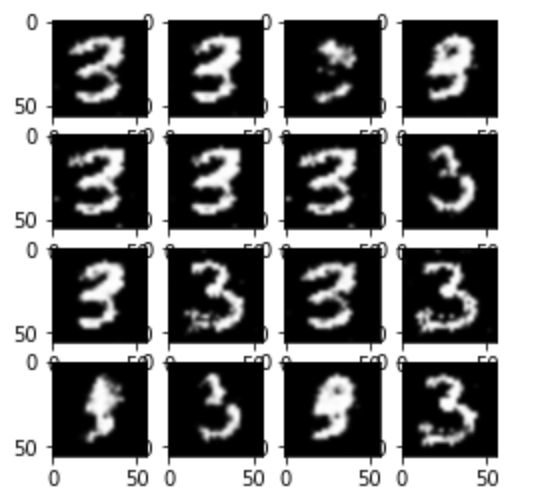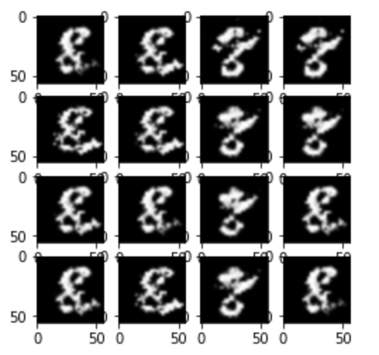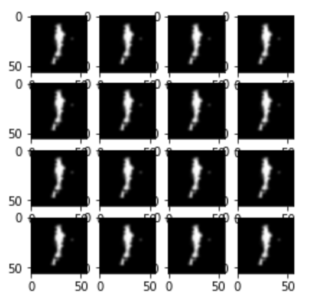
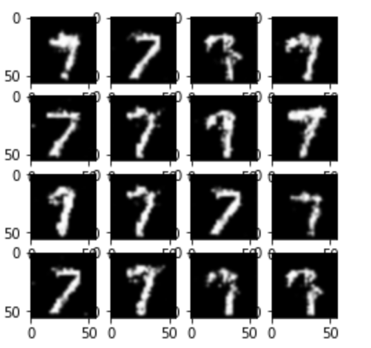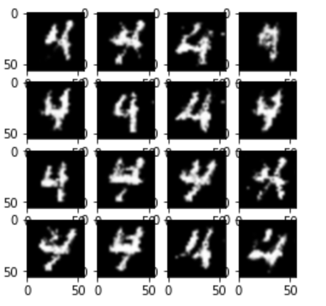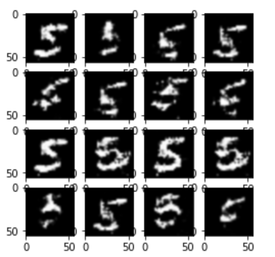


